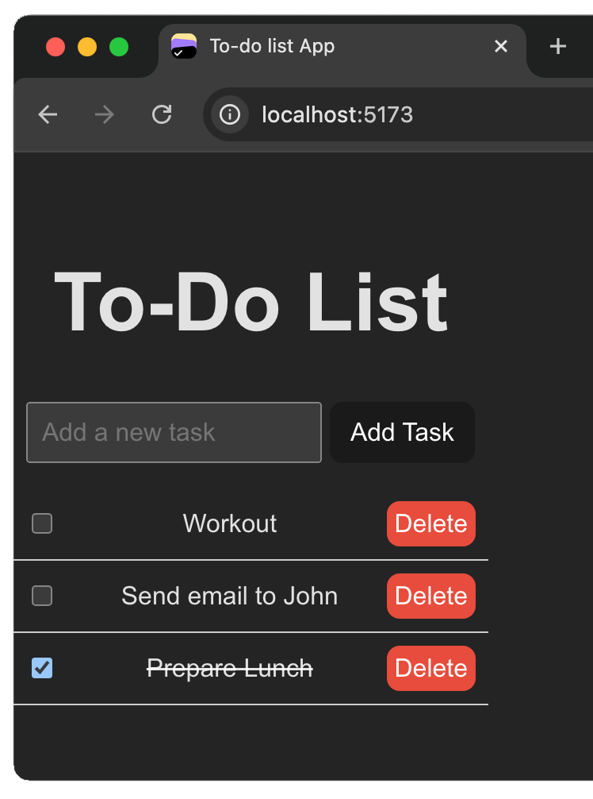

# To-do list 

Minimal To-Do List App is a simple and elegant solution to help you keep track of your tasks without the distractions of complex features. Designed with a minimalist approach, this app allows you to focus on what really matters: getting things done.

# How to run it

Inside your terminal execute:

1. cd /path/to/your/project/folder
2. npm create vite@latest todo-list --template react
3. Type 'y'
4. Use arrow keys and select React and JavaScript
5. cd todo-list
6. npm install
7. npm run dev
8. Go to: http://localhost:5173/
9. Load my /src and /public folders in your project

